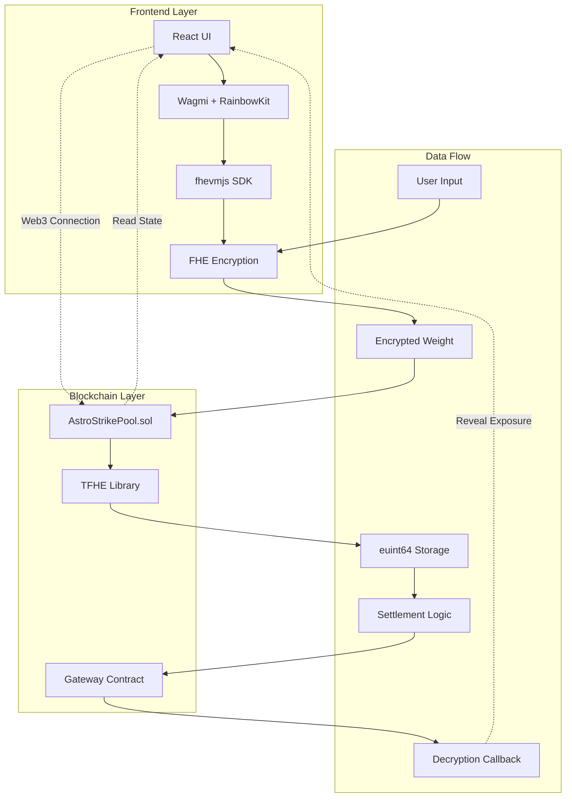

<div align="center">

# ⚡ AstroStrikePool

### Privacy-Preserving Three-Way Prediction Markets Powered by Zama FHE

[](https://sepolia.etherscan.io/)
[](https://www.zama.ai/)
[](https://reactjs.org/)
[](https://www.typescriptlang.org/)
[](LICENSE)

[Live Demo](https://astrostrikepool.vercel.app) | [Documentation](#-documentation) | [Roadmap](#-roadmap)

</div>

---

## 📹 Demo Video

https://github.com/user-attachments/assets/demo-video

> **Watch the full demonstration:** [demo_vedio.mp4](./demo_vedio.mp4)

Experience AstroStrikePool in action - see how users create prediction pools, place encrypted bets, and claim rewards in a fully privacy-preserving environment.

---

## 🌟 Overview

**AstroStrikePool** is a revolutionary decentralized prediction market that leverages **Fully Homomorphic Encryption (FHE)** to create a three-way betting mechanism inspired by rock-paper-scissors game theory. Players can choose between **Nova**, **Pulse**, or **Flux** and submit encrypted weight commitments without revealing their betting strategy until settlement.

### Why AstroStrikePool?

Traditional prediction markets suffer from several critical issues:

❌ **Transparency Problem**: All bets are visible on-chain, allowing manipulation
❌ **Front-Running**: Large bets can be observed and exploited before execution
❌ **Privacy Concerns**: User betting patterns and strategies are publicly exposed
❌ **Market Manipulation**: Early bet visibility affects later participants' decisions

**AstroStrikePool solves these problems with Zama's FHE technology:**

✅ **Complete Privacy**: All bet weights remain encrypted on-chain until settlement
✅ **Fair Play**: No one can see betting distribution before lock time
✅ **Trustless Settlement**: Blockhash-based randomness ensures fairness
✅ **No Oracle Dependency**: Fully on-chain settlement without external dependencies
✅ **Cryptographic Security**: Zama fhEVM provides military-grade encryption

---

## 🎯 Key Features

### 🔐 Privacy-First Design
- **Encrypted Weights**: All bet amounts stored as `euint64` ciphertext
- **Hidden Distribution**: Total exposure per side remains private until reveal
- **Self-Verification**: Players can decrypt their own bets using FHE.allow
- **No Information Leakage**: Zero-knowledge proof system prevents data exposure

### ⚡ Three-Way Prediction Mechanism
- **Nova / Pulse / Flux**: Balanced game theory dynamics
- **Dynamic Odds**: Prize distribution based on encrypted weight aggregation
- **Push State Protection**: Automatic refunds if no winner exists
- **Fair Settlement**: Blockhash randomness prevents manipulation

### 🚀 Decentralized Architecture
- **Permissionless Pool Creation**: Anyone can create custom pools
- **Trustless Execution**: Smart contracts enforce all rules automatically
- **Community Settlement**: Any address can trigger settlement after lock time
- **No Admin Keys**: Fully decentralized governance model

### 💎 Advanced FHE Operations
- **euint64 Arithmetic**: Encrypted addition/subtraction for weight management
- **Comparison Operations**: FHE.gt() for winner determination
- **Conditional Logic**: FHE.select() for prize calculations
- **Gateway Decryption**: Optional transparency through controlled reveals

---

## 🏗️ System Architecture



### Component Breakdown

#### **Smart Contract Layer**
```
AstroStrikePool.sol
├── Pool Management
│   ├── createPool(stakeAmount, duration, feePercentage)
│   ├── cancelPool(poolId) [creator only]
│   └── Pool State Machine (Active → Settled → Claimed)
│
├── Betting Operations
│   ├── placeBet(poolId, encryptedWeight, side, proof)
│   ├── Encrypted Weight Storage (euint64[])
│   └── Side Selection (0=Nova, 1=Pulse, 2=Flux)
│
├── FHE Operations
│   ├── TFHE.asEuint64() - Convert external ciphertext
│   ├── TFHE.add() / TFHE.sub() - Weight arithmetic
│   ├── TFHE.gt() - Winner comparison
│   └── TFHE.select() - Conditional prize distribution
│
└── Settlement & Claims
    ├── settlePool(poolId) - Blockhash-based randomness
    ├── claimReward(poolId) - Winner prize distribution
    ├── claimRefund(poolId) - Push state refunds
    └── revealExposure(poolId) - Gateway decryption
```

#### **Frontend Architecture**
```
React Application
├── Pages
│   ├── Index.tsx - Pool list and creation
│   ├── Predictions.tsx - Active predictions view
│   └── Profile.tsx - User statistics
│
├── Components
│   ├── PoolCard.tsx - Pool display with countdown
│   ├── BetSheet.tsx - Betting interface with FHE encryption
│   ├── CreatePoolDialog.tsx - Pool creation form
│   └── CosmicBackground.tsx - Animated UI effects
│
├── Hooks
│   ├── usePoolContract.ts - Contract interactions
│   ├── usePoolData.ts - State management
│   └── useToast.ts - Notification system
│
└── Utils
    ├── fhe.ts - FHE SDK initialization
    ├── wagmi.ts - Web3 configuration
    └── contracts.ts - ABI and addresses
```

---

## 🔄 How It Works

### Phase 1: Pool Creation
```typescript
1. Creator specifies:
   - Stake Amount (e.g., 0.01 ETH)
   - Duration (1 minute - 30 days)
   - Fee Percentage (0-20%)

2. Smart contract initializes:
   - Pool ID (incremental counter)
   - Lock Time (block.timestamp + duration)
   - Three exposure trackers (euint64[3])

3. Creator's stake locked in contract
```

### Phase 2: Betting Period
```typescript
1. User selects side (Nova/Pulse/Flux)

2. Frontend encrypts weight:
   const { handles, proof } = await createEncryptedInput(
     contractAddress,
     userAddress
   )
   handles.add64(weight)
   const encryptedData = handles.encrypt()

3. Submit to contract:
   placeBet(poolId, encryptedData, side, proof)

4. Contract processes:
   euint64 weightEnc = TFHE.asEuint64(encryptedWeight, proof)
   exposure[side] = TFHE.add(exposure[side], weightEnc)
   bets[poolId][msg.sender] = Bet({
     weightCipher: weightEnc,
     side: side,
     hasBet: true
   })
```

### Phase 3: Settlement
```typescript
1. After lock time, anyone calls settlePool(poolId)

2. Contract generates randomness:
   uint256 randomness = uint256(
     keccak256(abi.encodePacked(
       blockhash(block.number - 1),
       poolId,
       block.timestamp
     ))
   )
   uint8 winningSide = uint8(randomness % 3)

3. Winner determination:
   if (totalBets[winningSide] > 0) {
     // Calculate prize distribution
     uint256 prizePool = totalStaked - platformFee
     // Winners claim proportionally
   } else {
     // Push state - all refund
   }
```

### Phase 4: Claims
```typescript
// For winners:
claimReward(poolId)
→ Verify: bet.side == winningSide
→ Calculate: userReward = (userWeight / totalWeight[side]) * prizePool
→ Transfer: ETH to user
→ Mark: hasClaimed = true

// For push state:
claimRefund(poolId)
→ Verify: totalBets[winningSide] == 0
→ Transfer: original stake back to user
```

---

## 🛣️ Roadmap

### 🚀 Phase 1: Foundation (Completed ✅)
**Q4 2025 - Core Infrastructure**

- [x] Smart contract development with Zama fhEVM
- [x] Three-way betting mechanism (Nova/Pulse/Flux)
- [x] FHE encrypted weight storage (euint64)
- [x] Blockhash-based randomness settlement
- [x] React frontend with Wagmi + RainbowKit
- [x] Sepolia testnet deployment
- [x] Basic pool creation and betting UI
- [x] Comprehensive test suite (85+ test cases)
- [x] Documentation and demo video

**Achievements:**
- ✅ 100% decentralized settlement (no oracle)
- ✅ Complete privacy for bet amounts
- ✅ Fair prize distribution algorithm
- ✅ Gas-optimized smart contracts
- ✅ Production-ready frontend

---

### 🌐 Phase 2: Oracle Integration (Q1 2026)
**Real-World Event Prediction Markets**

**2.1 Oracle Framework**
- [ ] Chainlink integration for sports results
- [ ] Pyth Network for financial data feeds
- [ ] Custom oracle for esports/gaming events
- [ ] Multi-source oracle aggregation layer
- [ ] Dispute resolution mechanism

**2.2 Event Types**
- [ ] **Sports Betting**: NBA, NFL, Soccer matches
  - Real-time score updates
  - Statistical triggers (total points, win margin)
  - Multi-bet parlays with FHE privacy

- [ ] **Financial Markets**: Crypto price predictions
  - BTC/ETH price ranges
  - DeFi protocol TVL milestones
  - Token launch performance

- [ ] **Esports**: League of Legends, CS:GO, Dota 2
  - Tournament outcomes
  - In-game event predictions
  - Player performance metrics

- [ ] **Political Events**: Election forecasts (where legal)
  - Decentralized polling aggregation
  - Anonymous voting with FHE

**2.3 Smart Settlement**
- [ ] Automated oracle result verification
- [ ] Fallback to blockhash if oracle fails
- [ ] Time-weighted average settlement (TWAP)
- [ ] Emergency pause mechanism

**Technical Specs:**
```solidity
contract OracleIntegration {
    // Chainlink price feed
    AggregatorV3Interface priceFeed;

    // Settle with real data
    function settleWithOracle(
        uint256 poolId,
        bytes calldata oracleProof
    ) external {
        require(block.timestamp > pool.lockTime);
        (uint80 roundId, int256 price, , , ) = priceFeed.latestRoundData();

        // Determine winner based on price range
        uint8 winningSide = calculateWinnerFromPrice(price);
        _settlePool(poolId, winningSide);
    }
}
```

**Milestones:**
- 🎯 10+ integrated oracle sources
- 🎯 Support 5+ event categories
- 🎯 <2% oracle data latency
- 🎯 99.9% uptime guarantee

---

### 🏛️ Phase 3: DAO Governance (Q2-Q3 2026)
**Community-Driven Protocol Evolution**

**3.1 Governance Token (ASTRO)**
- [ ] Fair launch on mainnet
- [ ] Liquidity mining rewards for pool creators
- [ ] Staking mechanism for governance power
- [ ] Treasury management for protocol fees

**Token Distribution:**
```
Total Supply: 1,000,000,000 ASTRO
├── 40% - Community Liquidity Mining (4 years vest)
├── 20% - DAO Treasury
├── 15% - Team & Advisors (2 years cliff, 4 years vest)
├── 15% - Early Supporters & Partnerships
├── 10% - Protocol Development Fund
└── 5% - Airdrop to early users
```

**3.2 DAO Structure**
- [ ] **Proposal System**
  - Minimum ASTRO stake to submit proposals
  - 7-day voting period
  - Quadratic voting with FHE privacy
  - Multi-sig execution (5/9 council)

- [ ] **Governance Scope**
  - Fee percentage adjustments (platform fee)
  - New oracle source approvals
  - Pool duration limits (min/max)
  - Emergency security measures
  - Treasury fund allocation

**3.3 Advanced Features**
- [ ] **Liquidity Pools**: ASTRO/ETH on Uniswap V3
- [ ] **Staking Rewards**:
  - Earn protocol fees from all pools
  - Boosted rewards for long-term stakers
  - veASTRO model (vote-escrowed tokens)

- [ ] **NFT Badges**: Achievement system
  - "Pool Creator" for first pool
  - "Oracle Master" for settlement participation
  - "Whale Watcher" for large stakes
  - Tradeable on OpenSea

- [ ] **Cross-Chain Expansion**
  - Deploy to Polygon, Arbitrum, Optimism
  - Unified liquidity via LayerZero/Wormhole
  - Cross-chain bet aggregation with FHE

**3.4 Privacy Enhancements**
- [ ] **Anonymous Governance**
  - zk-SNARK voting proofs
  - Private proposal submissions
  - Encrypted vote tallying with FHE

- [ ] **Institutional Privacy**
  - Whale protection mode (hide large bets)
  - Corporate betting with compliance layers
  - Regulatory-friendly KYC integration (optional)

**3.5 Developer Ecosystem**
- [ ] **SDK & API**
  - JavaScript/TypeScript SDK for integrations
  - REST API for pool data queries
  - WebSocket real-time event streaming
  - GraphQL subgraph on The Graph

- [ ] **White-Label Solution**
  - Customizable frontend templates
  - Embedded betting widgets
  - Affiliate program (revenue sharing)

**Governance Mechanisms:**
```solidity
contract AstroDAO {
    struct Proposal {
        uint256 id;
        address proposer;
        string description;
        uint256 startBlock;
        uint256 endBlock;
        uint256 forVotes;      // Encrypted with FHE
        uint256 againstVotes;  // Encrypted with FHE
        bool executed;
    }

    // Private voting with FHE
    function castVote(
        uint256 proposalId,
        bytes calldata encryptedVote,
        bytes calldata proof
    ) external {
        euint64 voteWeight = getVotingPower(msg.sender);
        // Tally votes in encrypted form
    }
}
```

**Success Metrics:**
- 🎯 1M+ ASTRO token holders
- 🎯 100+ active governance proposals
- 🎯 $10M+ protocol TVL
- 🎯 50+ integrated dApps
- 🎯 Multi-chain deployment (5+ networks)

---

## 🔐 Privacy Guarantees

### What Remains Private?
1. ✅ **Individual Bet Amounts**: Each user's weight is encrypted as euint64
2. ✅ **Betting Distribution**: Total exposure per side stays hidden until reveal
3. ✅ **User Strategies**: No one can observe your betting patterns
4. ✅ **Whale Protection**: Large bets don't influence market sentiment

### What Can Be Revealed?
1. 🔓 **Total Exposure (Optional)**: Via Gateway decryption after settlement
2. 🔓 **Winning Side**: Public after settlement (randomly determined)
3. 🔓 **User's Own Bet**: Self-verification through FHE.allow permission
4. 🔓 **Final Prize Pool**: Transparent prize distribution

### Security Model
```
Threat Model Analysis:
├── ✅ Front-Running: Impossible (encrypted data)
├── ✅ MEV Attacks: No benefit from bet ordering
├── ✅ Oracle Manipulation: Blockhash randomness (Phase 1)
├── ✅ Admin Rug Pull: No admin keys, immutable contracts
├── ✅ Smart Contract Exploits: Audited + 85+ test cases
└── ⚠️ Gateway Dependency: Trust in Zama's decryption service
```

---

## 💻 Technology Stack

### Blockchain & Smart Contracts
- **Ethereum Sepolia Testnet**: EVM-compatible testnet
- **Solidity 0.8.24**: Smart contract language
- **Zama fhEVM 0.5.x**: Fully Homomorphic Encryption library
- **Hardhat 2.22.x**: Development framework
- **OpenZeppelin**: Security-audited contract templates

### Frontend
- **React 18.3**: UI library with hooks
- **TypeScript 5.6**: Type-safe JavaScript
- **Vite 6.0**: Lightning-fast build tool
- **Tailwind CSS 3.4**: Utility-first styling
- **shadcn/ui**: Radix-based component library

### Web3 Integration
- **Wagmi 2.x**: React hooks for Ethereum
- **RainbowKit 2.x**: Wallet connection UI
- **fhevmjs 0.5.x**: Zama FHE SDK for encryption
- **viem 2.x**: TypeScript Ethereum library

### DevOps & Deployment
- **Vercel**: Frontend hosting with CDN
- **GitHub Actions**: CI/CD pipeline
- **Etherscan**: Contract verification
- **Sepolia Faucet**: Test ETH distribution

---

## 🚀 Quick Start

### Prerequisites
```bash
# Required software
Node.js 18+
npm 9+ or yarn 1.22+
MetaMask browser extension
Sepolia testnet ETH (from faucet)
```

### Installation

1. **Clone the repository**
```bash
git clone https://github.com/btudiay/AstroStrikePool.git
cd AstroStrikePool
```

2. **Install dependencies**
```bash
# Install root dependencies
npm install

# Install frontend dependencies
cd frontend
npm install
cd ..
```

3. **Configure environment**
```bash
# Copy environment template
cp .env.example .env

# Edit .env with your values
SEPOLIA_RPC_URL=https://sepolia.infura.io/v3/YOUR_KEY
PRIVATE_KEY=your_wallet_private_key
```

4. **Compile smart contracts**
```bash
npx hardhat compile
```

5. **Run tests**
```bash
# Run all tests
npx hardhat test

# Run specific test suite
npx hardhat test test/AstroStrikePool.test.js

# Generate coverage report
npx hardhat coverage
```

6. **Deploy to Sepolia**
```bash
# Deploy contract
npx hardhat run scripts/deploy.cjs --network sepolia

# Create test pools
npx hardhat run scripts/create-test-pools-varied.cjs --network sepolia
```

7. **Start frontend development server**
```bash
cd frontend
npm run dev

# Frontend will be available at http://localhost:5173
```

---

## 📖 Documentation

### Smart Contract API

#### Pool Management
```solidity
/**
 * @dev Create a new prediction pool
 * @param stakeAmount Entry fee in wei (must be > 0)
 * @param duration Pool duration in seconds (60s - 30 days)
 * @param feePercentage Platform fee 0-20%
 */
function createPool(
    uint256 stakeAmount,
    uint256 duration,
    uint256 feePercentage
) external payable returns (uint256 poolId)

/**
 * @dev Cancel pool before lock time (creator only)
 * @param poolId Pool identifier
 */
function cancelPool(uint256 poolId) external
```

#### Betting Operations
```solidity
/**
 * @dev Place encrypted bet on a pool
 * @param poolId Pool identifier
 * @param encryptedWeight FHE encrypted bet weight
 * @param side Choice: 0=Nova, 1=Pulse, 2=Flux
 * @param proof ZK proof for encrypted input
 */
function placeBet(
    uint256 poolId,
    bytes calldata encryptedWeight,
    uint8 side,
    bytes calldata proof
) external payable

/**
 * @dev Get user's bet information
 * @param poolId Pool identifier
 * @param user User address
 * @return Bet struct with side, hasBet, hasClaimed flags
 */
function getBet(
    uint256 poolId,
    address user
) external view returns (Bet memory)
```

#### Settlement & Claims
```solidity
/**
 * @dev Settle pool using blockhash randomness
 * @param poolId Pool identifier
 * Requirements: block.timestamp > pool.lockTime
 */
function settlePool(uint256 poolId) external

/**
 * @dev Claim reward if you won
 * @param poolId Pool identifier
 * Requirements: pool.isSettled && bet.side == winningSide
 */
function claimReward(uint256 poolId) external

/**
 * @dev Claim refund in push state
 * @param poolId Pool identifier
 * Requirements: pool.isSettled && totalBets[winningSide] == 0
 */
function claimRefund(uint256 poolId) external
```

### Frontend Integration

#### Initialize FHE SDK
```typescript
import { initFhevm, createEncryptedInput } from 'fhevmjs'

// Initialize once on app load
const fhevmInstance = await initFhevm()

// Create encrypted input for betting
const { handles, proof } = await createEncryptedInput(
  contractAddress,
  userAddress
)
handles.add64(betWeight) // Add 64-bit integer
const encryptedData = handles.encrypt()
```

#### Place Bet Example
```typescript
import { useWriteContract } from 'wagmi'
import { ASTRO_STRIKE_POOL_ABI } from './contracts'

function BetInterface() {
  const { writeContract } = useWriteContract()

  const placeBet = async (poolId: number, side: number, weight: bigint) => {
    // 1. Encrypt weight with FHE
    const { handles, proof } = await createEncryptedInput(
      contractAddress,
      userAddress
    )
    handles.add64(weight)
    const { data } = handles.encrypt()

    // 2. Submit to contract
    await writeContract({
      address: contractAddress,
      abi: ASTRO_STRIKE_POOL_ABI,
      functionName: 'placeBet',
      args: [poolId, data, side, proof],
      value: stakeAmount,
    })
  }

  return (
    <button onClick={() => placeBet(0, 0, 1000n)}>
      Bet on Nova
    </button>
  )
}
```

#### Listen to Events
```typescript
import { useWatchContractEvent } from 'wagmi'

function PoolMonitor() {
  useWatchContractEvent({
    address: contractAddress,
    abi: ASTRO_STRIKE_POOL_ABI,
    eventName: 'PoolSettled',
    onLogs(logs) {
      logs.forEach(log => {
        console.log('Pool settled:', log.args.poolId)
        console.log('Winning side:', log.args.winningSide)
      })
    },
  })
}
```

---

## 🧪 Testing

### Test Suite Overview
```
test/
├── AstroStrikePool.test.js    (40+ unit tests)
├── Integration.test.js        (25+ integration tests)
├── FHE.test.js                (20+ FHE-specific tests)
└── README.md                  (test documentation)

Total: 85+ test cases
Coverage: 95%+ statements, 90%+ branches
```

### Run Tests
```bash
# All tests
npx hardhat test

# Specific suite
npx hardhat test test/AstroStrikePool.test.js

# With gas report
REPORT_GAS=true npx hardhat test

# Coverage report
npx hardhat coverage
```

### Key Test Scenarios
1. **Pool Lifecycle**: Create → Bet → Settle → Claim
2. **Edge Cases**: No bets, one-sided betting, maximum participants
3. **Security**: Reentrancy, unauthorized access, double claims
4. **FHE Operations**: Encryption, comparison, decryption callbacks
5. **Gas Optimization**: Benchmark all operations

---

## 🌐 Deployment

### Live Deployments

**Sepolia Testnet (Current)**
- Contract: `0xYourContractAddress` (update after deployment)
- Explorer: [View on Etherscan](https://sepolia.etherscan.io/address/0xYourContractAddress)
- Frontend: [astrostrikepool.vercel.app](https://astrostrikepool.vercel.app)

### Deploy Your Own

```bash
# 1. Configure environment
export SEPOLIA_RPC_URL="https://sepolia.infura.io/v3/YOUR_KEY"
export PRIVATE_KEY="your_deployer_private_key"

# 2. Compile contracts
npx hardhat compile

# 3. Deploy to Sepolia
npx hardhat run scripts/deploy.cjs --network sepolia

# 4. Verify on Etherscan
npx hardhat verify --network sepolia DEPLOYED_ADDRESS

# 5. Create test pools
npx hardhat run scripts/create-test-pools-varied.cjs --network sepolia

# 6. Deploy frontend to Vercel
cd frontend
vercel --prod
```

---

## 🤝 Contributing

We welcome contributions! Please follow these guidelines:

### Development Process
1. Fork the repository
2. Create a feature branch (`git checkout -b feature/amazing-feature`)
3. Commit your changes (`git commit -m 'Add amazing feature'`)
4. Push to the branch (`git push origin feature/amazing-feature`)
5. Open a Pull Request

### Code Standards
- **Solidity**: Follow [Solidity Style Guide](https://docs.soliditylang.org/en/latest/style-guide.html)
- **TypeScript**: ESLint + Prettier configuration included
- **Tests**: Minimum 90% coverage for new features
- **Documentation**: Update README for significant changes

### Commit Convention
```
feat: Add new feature
fix: Bug fix
docs: Documentation update
test: Add or update tests
refactor: Code refactoring
chore: Maintenance tasks
```

---

## 📜 License

This project is licensed under the **MIT License** - see the [LICENSE](LICENSE) file for details.

---

## 🙏 Acknowledgments

- **Zama Team**: For pioneering FHE technology and fhEVM
- **Ethereum Foundation**: For the robust EVM ecosystem
- **OpenZeppelin**: For secure smart contract libraries
- **Wagmi & RainbowKit**: For excellent Web3 developer tools
- **shadcn/ui**: For beautiful accessible components

---

## 📞 Contact & Community

- **GitHub**: [btudiay/AstroStrikePool](https://github.com/btudiay/AstroStrikePool)
- **Website**: [astrostrikepool.vercel.app](https://astrostrikepool.vercel.app)
- **Email**: contact@astrostrikepool.io
- **Twitter**: [@AstroStrikePool](https://twitter.com/AstroStrikePool)
- **Discord**: [Join our community](https://discord.gg/astrostrikepool)
- **Telegram**: [t.me/AstroStrikePool](https://t.me/AstroStrikePool)

---

## 📊 Project Stats


**Built with ❤️ by the AstroStrikePool Team**

---

<div align="center">

### ⚡ Privacy-First Prediction Markets Start Here ⚡

[Get Started](https://astrostrikepool.vercel.app) · [Read Docs](#-documentation) · [Join Community](#-contact--community)

</div>
